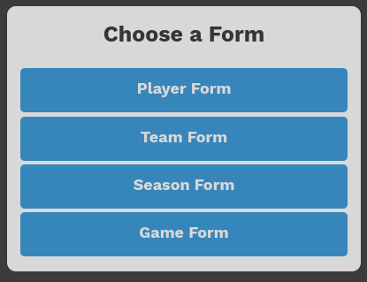

# IPL Archival System
A archival system for IPL (can be used with other leagues as well) using Postgres, Golang, React built for DBMS project by:

```
Ashutosh Bohara
Aditya Timalsina
Pranav Joshi
```

## Building and Executing
1. Fork this repo and change directory.
```
git clone git@github.com:autives/ipl-archive-system.git
cd ipl-archive-system
```

2. Run the Postgres server, and create a new database.
```
sudo systemctl start postgresql.service
createdb <dbname>
psql <dbname> <username>
```
3. Connect to the database and create the database schema.
```
psql <dbname> <username>
\i database/schema.sql
exit
```
4. Create a `dbenv.json` file with credentials to connect to the database in  the `database` direcotory.
```
{
    "host": "localhost",
    "port": 5432,
    "user": "<username>",
    "password": "<password>",
    "dbname": "<dbname>"
}
```
5. Run the Go backend
```
cd backend
mkdir images/players images/teams
go run main.go
```
6. In another terminal, run the frontend
```
cd frontend
npm install
npm start
```
7. Connect to `localhost:3000` from a browser, and enjoy exploring

## Snapshots
<figure align="center">
	
	<figcaption>Forms</figcaption>
</figure>

<figure align="center">
	
	<figcaption>Player Form</figcaption>
</figure>

<figure align="center">
	
	<figcaption>Game Form</figcaption>
</figure>

<figure align="center">
	
	<figcaption>Player Stats</figcaption>
</figure>

<figure align="center">
	
	<figcaption>Team List</figcaption>
</figure>


